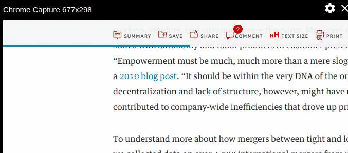

A quick way to enhance the user experience when they are scrolling through a page is to show them how far or how long they have to go before they finish the article.

A good way to show that is to showthem via a progress bar like 

