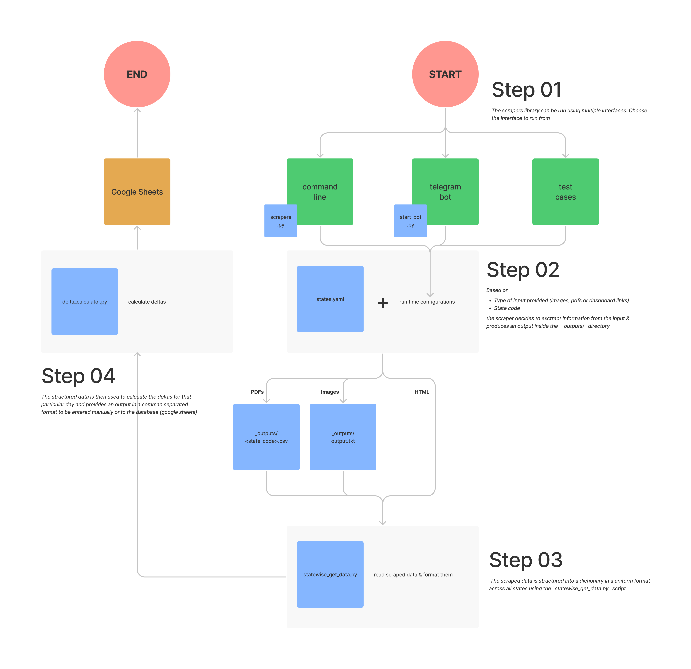

<ul class="collage">
  <li></li>
</ul>

On the evening that the beloved platform [covid19india.org](https://www.covid19india.org) announced it was shutting down operations, I was scoping a project with Development Data Lab as the Chapter Leader for DataKind Bengaluru. We were exploring data from pre-independence India to understand caste-based social norms. You can read about that [here](https://medium.com/datakind-bangalore/bye-bye-covid19bharat-org-6178f3194a25). But suddenly, something bigger demanded attention.

**covid19india.org** had become the single source of truth for millions tracking daily COVID-19 cases in India during one of the darkest global crises in recent history. Running such an operation was no small feat. That same evening, India’s leading data journalist, **Rukmini S**, reached out. She had worked with covid19india before and was informed of its shutdown. Development Data Lab had recommended me. The baton was being passed. Could I carry it?, was the question

I was flooded with doubt. *Was I capable? What if I failed?* But a stronger voice inside said I needed to step up. People depended on this data. Even though the pandemic seemed to be subsiding in October 2021, the uncertainty lingered. Would this effort be in vain? Or was it time to shift focus—from tracking cases to tracking vaccinations?

**covid19india.org** had a brand, a brilliant crowdsourced architecture, and an army of volunteers. Starting anew needed visibility. With Rukmini's voice amplifying the call, we tweeted and blogged our announcement. The response was overwhelming. Data visualization pros, civic tech geeks, and public health nerds responded enthusiastically. It was humbling.

### Unpacking the Beast

Before October 2021, I joined the covid19india core Telegram group to understand the operations and platform architecture. I discovered we weren’t alone. At least six other organizations were keen to continue the initiative: IIT Hyderabad, Indian Medical Council, ISI Bangalore, and more. Researchers at IISc and the Indian Mathematical Society were heavily dependent on this data. The urgency was real. I felt like I was being slow-cooked like a biryani over hot coals.

To grasp the technical setup, I teamed up with my brilliant colleague **Soumya Ranjan** from Gramener and a core member from covid19india. They helped me translate the existing stack—Python and React-heavy—into something I could understand and, more importantly, communicate to new volunteers.

### Rebuilding from Scratch

Over the next few months, we rewrote the architecture:

* A **Python-based CLI** to extract case data
* A **Telegram chatbot** for quick entry and collaboration
* A **web interface** for volunteer-friendly access

All of it is on [github](https://github.com/DataKind-BLR/covid19bharat_scrapers)

### What We Faced

* **Finding reliable sources** for daily case data
* **Dealing with shifting data formats** (Odisha changed their table structure overnight)
* **Volunteer dropoffs** and handovers
* **Low tech fluency among some volunteers**

Despite all this, our team grew. We had state specific volunteers burning the midnight oil, tracking and verifying numbers. By Jan/Feb 2022, as India entered its last major wave, we added vaccination tracking and partnered with **IBM**, who began publishing insights through our platform.

### The Final Stretch

We carried the effort for another 15 months. By January 2023, over 85% of India had received two vaccine doses. Case tracking had become trivial. Daily traffic plummeted. We knew it was time. In January 2023, we officially retired [covid19bharat.org](https://medium.com/datakind-bangalore/bye-bye-covid19bharat-org-6178f3194a25).

### What I Learned

* **To communicate something complex, you must understand it inside out.**

* Tech:

  * GitHub Actions + GitHub Pages
  * React components
  * Python CLI development
  * Telegram bots
  * Camelot for reading tabular images

* People:

  * Recruiting and managing volunteers
  * Tracking responsibilities, handovers, data mismatches
  * Leveraging platforms like Twitter to build momentum

But most importantly: I learned to trust myself. I deliberately took on something scary and massive, and I pulled it off—with an incredible team. That’s a lesson I’ll carry for life.

> 🙏 To the 100+ volunteers, to the silent heroes of covid19india, and to everyone who tracked a number and made it count (literally); Thank you.

