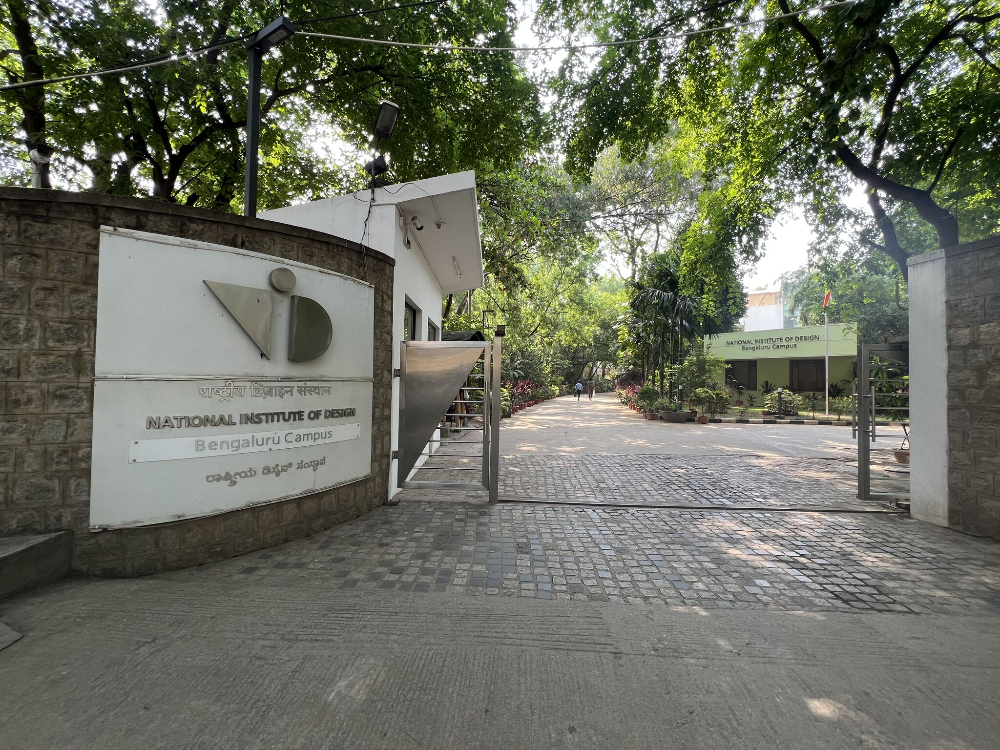
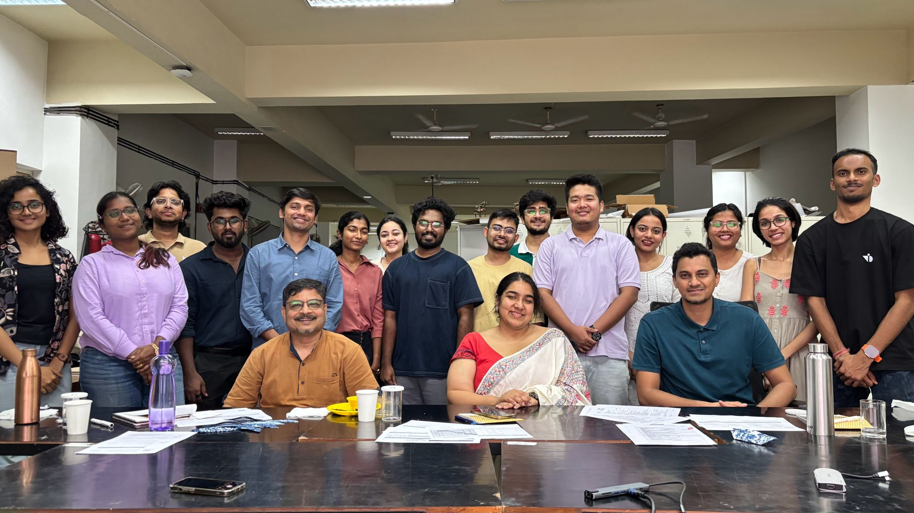
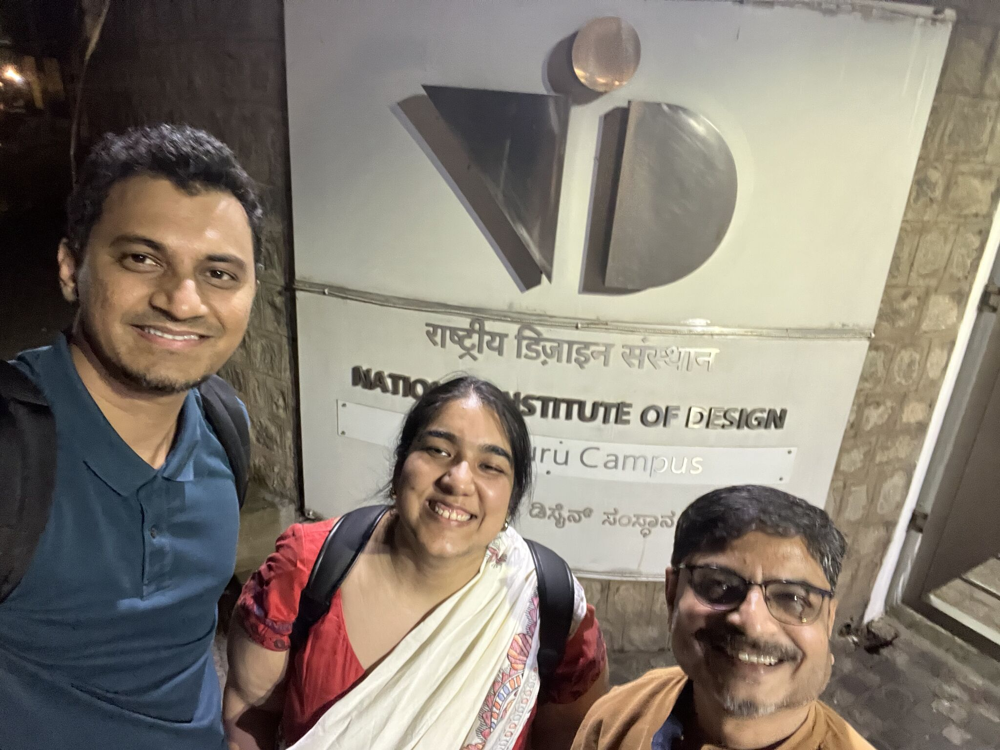

<ul class="collage">
  <li></li>
</ul>

This past week, I had the unique opportunity to sit on the other side of the design table—as a first-time jury member at the National Institute of Design (NID), Bangalore, reviewing the work of students from the Information Design course. What I expected to be a day of critique turned into something far richer: a moment of mutual learning, renewed curiosity, and rediscovery of what it means to communicate through design. It also gave me a brief experience of what it feels like to be a student at NID.

As someone who transitioned into design through the winding roads of technology, data, and self-driven projects like covid19bharat.org, I’ve always valued clarity, context, and compassion in information. And sitting with these students—each immersed in their own complex systems, stories, and experiments—I found those principles reflected and reimagined in wonderful ways.

## Key Takeaways

🔹 **Design thinking is alive and well (but evolving)**
Many of the students were not just making visual artefacts—they were designing systems of understanding. Whether it was representing their own personal data or mapping emotional states through visual metaphors, the emphasis was on meaning, not just aesthetics. It reminded me that information design is not about beautiful visualisations—it’s about communicating clearly.

🔹 **The craft of narrative still matters**
Some of the most impactful projects were those that balanced data and research rigour with a human lens. One student narrated the anciend weapon design during the Marathas regime, printed into a beautiful coffee-table book, representing in the phases of a painting, which felt like a poetic move that turned information into experience.

🔹 **constraints lead to better conversations**
With limited time and resources, students had to make tough design decisions. It was in their trade-offs—what they chose to simplify, omit, or prioritize—that their design thinking really shone. As a reviewer, my role wasn’t to correct those decisions, but to unpack their reasoning.

🔹 **The power of metaphors & analogies**
Apart from being on the jury, I spent a lot of time with Chakradhar Saswade sir, the head of the information design programme and also a fellow MSU Baroda graduate. He took the time to meticulously show his work and the behind-the-scene thought processes as well as walked me around the campus showing me the lab areas, past student's works as well as lecture halls. I am very grateful to have met him. His impressions have left a long lasting mark on me - as I endure towards understanding the depths of communication and visual design approachs he spoke about. I apsire to practice these principles in my own work.

## Anecdotes I won't forget

💬 At the end I nudged them to have a look at the Bret Victor's living by principle. Holds true everytime and how creators yearn to immediately need to see the feedback when creating something

🎯 Some of the projects were crafted into 3d printed materials and some into finely knitted pieces of cloth - embedding meaning and information. This was very inspiring to me.

🤌 Was inspiring to meet my fellow jury member, a very well known journalist, and now running the show from Revisual labs, Gurman Bhatia.

## Why This Experience Mattered

Being on the jury wasn’t about "judging" students—it was about holding space for them to reflect, refine, and reframe. And in return, I walked away with sharpened eyes, inspired by the next generation of designers who are asking questions we all should be asking:

- Who is this for?
- How will it be understood?
- And what responsibility do we hold when we design information that shapes opinions and actions?

As I returned to my role at SAP, designing for enterprise AI systems, I carried with me the energy from that jury room. Because whether you’re mapping urban transit or automating a factory floor, designing and communicating with clarity is the real brief.

<ul class="collage">
  <li></li>
  <li></li>
  <li></li>
</ul>

